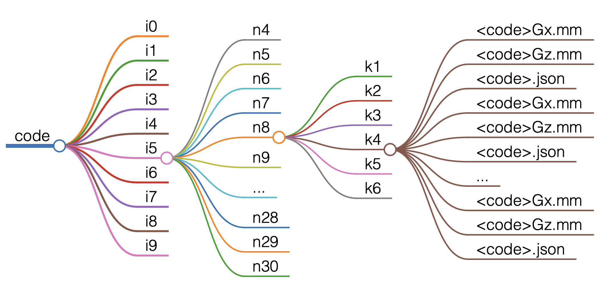

# CSS-Code-Database
Author: Weilei Zeng

This is a database of CSS codes, with `n=4..30` and distances up to 5/6. All parameters were saved, including k, x, and z stabilizers, in JSON format. Stabilizer matrices were saved in Matrix Market Format.

## Purpose
When doing research related to CSS codes, small sample codes are needed to get quick results or to construct product codes. A database for codes with various parameters will ease this process a lot.

## Data download:
The folder `codes` has enough codes to generate the table. For more codes with duplicated parameters and other versions, please download from the [GitHub release page](https://github.com/WeileiZeng/CSS-Code-Database/releases) or [Google Drive](https://drive.google.com/drive/folders/1Ju3D4Yif_sBxDkR-sW2LkfWtnPXHSpSU?usp=sharing)

File list
|Filename| Size| Codes count|Content|
|-|-|-|-|
|sample.tar| 45M|34,582| only i1 |
|css-codes-v1.0.tar|382M| 400,000+ |i0 - i9 |

Folder structure:




Sample file name (replace `n6k4d1-x1z1dx1dz1-1` for `<code>`):
- `codes/i1/n6/k4/n6k4d1-x1z1dx1dz1-1Gx.mm`
- `codes/i1/n6/k4/n6k4d1-x1z1dx1dz1-1Gz.mm`
- `codes/i1/n6/k4/n6k4d1-x1z1dx1dz1-1.json`

Format: replace <> for allowed parameters
- `codes/i<>/n<>/k<>/n<>k<>d<>-x<>z<>dx<>dz<>-<>.json`
- `codes/i<>/n<>/k<>/n<>k<>d<>-x<>z<>dx<>dz<>-<>Gx.mm`
- `codes/i<>/n<>/k<>/n<>k<>d<>-x<>z<>dx<>dz<>-<>Gz.mm`

## How to use
The data comply with Matrix Market and JSON format and can be extracted by any IO tools. Here we provide sample code in Python. Check out the notebook [dataIO.ipynb]()

## [[n,k,d]] table
version 1.3, (run3 as of Sept 20, 2023)

_Disclaimer_: This table displays collected statistics from heavy random sampling. Theoretically, it is only the lower distance bound for each (k,d) set, though it matches the maximum distance for most entries.

Row index for n, column index for k, and element for d

```
[n,k,d] table
n=0:    [   1  2  3  4  5  6  7  8  9     1  2  3  4  5  6  7  8  9     1  2  3  4  5  6  7]
n=1:    [                                                                                  ]
n=2:    [                                                                                  ]
n=3:    [                                                                                  ]
n=4:    [                                                                                  ]
n=5:    [   2  2                                                                           ]
n=6:    [   2  2  2  1                                                                     ]
n=7:    [   3  2  2  2  1                                                                  ]
n=8:    [   3  2  2  2  2                                                                  ]
n=9:    [   3  2  2  2  2  1                                                               ]
n=10:   [   3  2  2  2  2  2  2  1                                                         ]
n=11:   [   3  3  2  2  2  2  2  1  1                                                      ]
n=12:   [   3  3  3  2  2  2  2  2  1                                                      ]
n=13:   [   3  3  3  2  2  2  2  2  2  1                                                   ]
n=14:   [   3  3  3  3  3  2  2  2  2  2  1                                                ]
n=15:   [   4  3  3  3  3  2  2  2  2  2  2  1                                             ]
n=16:   [   4  3  3  3  3  2  2  2  2  2  2  2  1                                          ]
n=17:   [   4  4  3  3  3  3  3  2  2  2  2  2  2  1                                       ]
n=18:   [   4  4  3  3  3  3  3  2  2  2  2  2  2  2  1                                    ]
n=19:   [   4  4  3  3  3  3  3  3  2  2  2  2  2  2  2  1                                 ]
n=20:   [   4  4  4  3  3  3  3  3  2  2  2  2  2  2  2  2  1                              ]
n=21:   [   4  4  4  4  3  3  3  3  3  2  2  2  2  2  2  2  2  1                           ]
n=22:   [   4  4  4  4  3  3  3  3  3  3  2  2  2  2  2  2  2  2  1                        ]
n=23:   [   5  4  4  4  3  3  3  3  3  3  2  2  2  2  2  2  2  2  2  1                     ]
n=24:   [   5  4  4  4  4  3  3  3  3  3  3  2  2  2  2  2  2  2  2  1                     ]
n=25:   [   5  4  4  4  4  4  3  3  3  3  3  3  2  2  2  2  2  2  2  2  1  1               ]
n=26:   [   5  5  4  4  4  4  4  3  3  3  3  3  3  2  2  2  2  2  2  2  2  2  1            ]
n=27:   [   5  5  4  4  4  4  4  3  3  3  3  3  3  2  2  2  2  2  2  2  2  2  1  1         ]
n=28:   [   5  5  4  4  4  4  4  3  3  3  3  3  3  3  2  2  2  2  2  2  2  2  2  1  1      ]
n=29:   [   5  5  4  4  4  4  4  3  3  3  3  3  3  3  3  2  2  2  2  2  2  2  2  2  1      ]
n=30:   [   5  5  5  4  4  4  4  4  3  3  3  3  3  3  3  2  2  2  2  2  2  2  2  2  2  1  1]
total number of codes: 15963
```

Algorithm
```
for n=4..30
    for rx=1..<n-2>
	for rz=1..<n-rx-2>
	    generate random matrix Hx
	    solve for dual matrix G such that Hx*G^T=0
	    get Hz by concatenating G into rz rows 
	    estimate parameters n,k,d,dx,dz，
	    if unique
	        save CSS code defined by parity check matrices Hx and Hz, 
	    end if
	end for
    end for
end for	    
```

## LICENSE
This database complies with the MIT License. It is open to use and build upon it.
